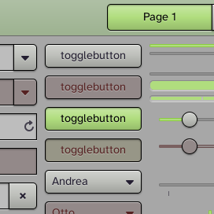
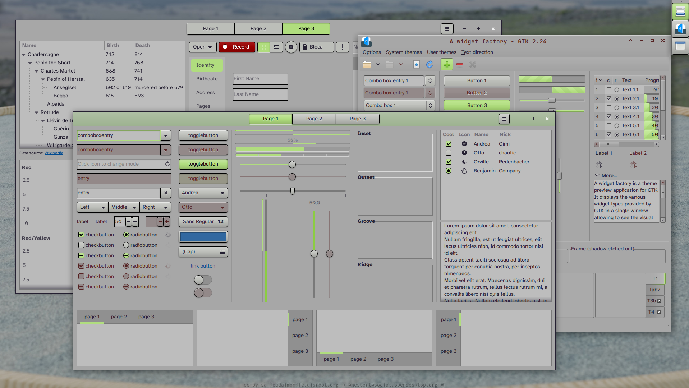
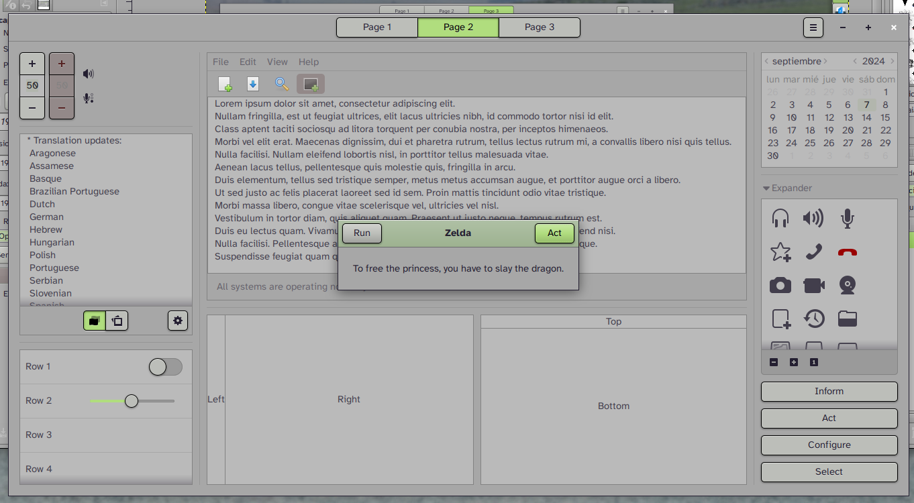
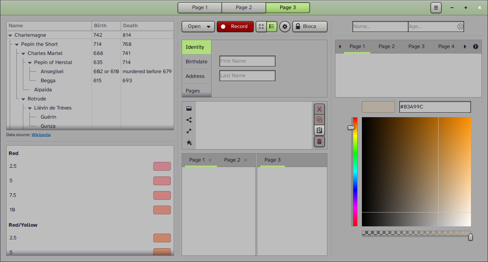
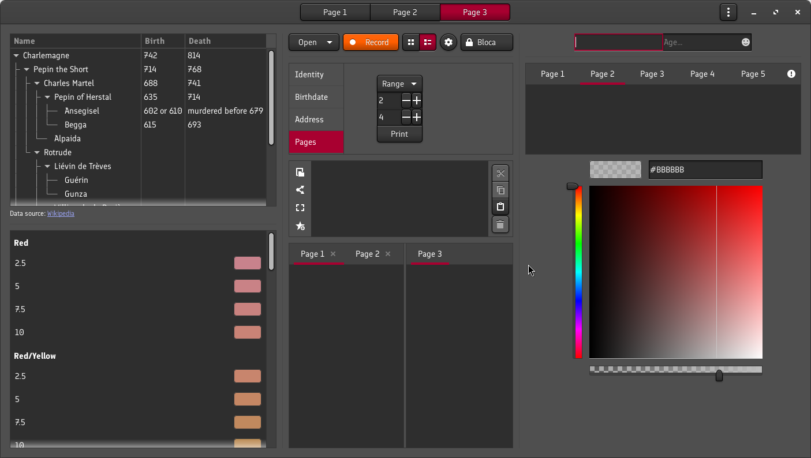

# Skewaita

This was my first serious attempt with a coherent theme for GTK2, GTK3 and GTK4. It is yet anohter skeuomorphic theme (that is, non-flat, that tries to imitate real-world objects and interfaces, like real three-dimensional buttons). 

This theme is based on Adwaita GTK3 and GTK4 (source sasscs!) and built from there. Sources are also available.

GTK2 is based on Clearlooks.

It is a light theme but with gray tones, in order to be easy on the eyes. Accents are bright green, so selected text stays the same color. Disabled elements have a subtle red tint, in order to clearly identify their state.

I've created a way to use different color themes:

- go to `source/templates/` directory and run `./use_scheme.sh name_of_color_scheme` (for example: `./use_scheme.sh colorscheme-Skewaita_original_light.sh`
- move one directory upwards with `cd ..` and rebuild theme, using new selected scheme, and bearing in mind whether it's a light or a dark theme: `./compile.sh light` or `./compile.sh dark`

There are many dark and light themes included already, so if you don't like the default theme, but do like the look of the controls, be sure to check them out too!

It has been updated more or less regularly.

Big previews:

Now dark themes look great too!